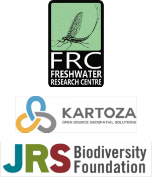

# Citations

## Citation guidelines

Data accessed through the FBIS are free for all—but not free of obligations. Under the terms of the FBIS data users agreement, users who download individual datasets or search results and use them in research or policy agree to cite them using the referencing information provided in the metadata for each data record. 

Good citation practices ensure scientific transparency and reproducibility by guiding other researchers to the original sources of information. They also reward data-publishing institutions and individuals by reinforcing the value of sharing open data and demonstrating its impact to their stakeholders and funders.

Users are strongly encouraged to cite data retrieved from the FBIS network according to the recommended citation:

**Freshwater Biodiversity Information System (FBIS). 2022. Downloaded from https://freshwaterbiodiversity.org on [current date]**

Note: Users also need to cite the individual source references that they have used, which are available in the metadata table provided on the detailed dashboards.

To cite the scientific article published in the African Journal of Aquatic Science.

Dallas HF, Shelton JM, Sutton T, Tri Ciputra D, Kajee M and Job N.  2021. Development of a freshwater biodiversity information system for evaluating long-term change in rivers in South Africa.  African Journal of Aquatic Science. doi.org/10.2989/16085914.2021.1982672

To cite the User Manual:

Freshwater Biodiversity Information System (FBIS). 2022. FBIS User Manual. Prepared by the Freshwater Research Centre and Kartoza.

Website:

freshwaterbiodiversity.org

## Citation examples

Kajee Mohammed, Henry Dominic A. W., Dallas Helen F., Griffiths Charles L., Pegg Josephine, Van der Colff Dewidine, Impson Dean, Chakona Albert, Raimondo Domitilla C., Job Nancy M., Paxton Bruce R., Jordaan Martine S., Bills Roger, Roux Francois, Zengeya Tsungai A., Hoffman Andre, Rivers-Moore Nick, Shelton Jeremy M. (2023) **How the Freshwater Biodiversity Information System (FBIS) is supporting national freshwater fish conservation decisions in South Africa**, Frontiers in Environmental Science, Vol 11, DOI: DOI=10.3389/fenvs.2023.1122223

https://www.frontiersin.org/articles/10.3389/fenvs.2023.1122223

----

Helen Dallas, Jeremy Shelton, Tim Sutton, Dimas Tri Cuptura, Mohammed Kajee & Nancy Job (2022) **The Freshwater Biodiversity Information System (FBIS) – mobilising data for evaluating long-term change in South African rivers**, African Journal of Aquatic Science, 47:3, 291-306, DOI: 10.2989/16085914.2021.1982672

https://www.tandfonline.com/doi/abs/10.2989/16085914.2021.1982672

----

Kajee, Mohammed, Helen F. Dallas, Aneri Swanepoel, Charles L. Griffiths, and Jeremy M. Shelton. 2023. “The Freshwater Biodiversity Information System (FBIS) Fish Data: A Georeferenced Dataset of Freshwater Fishes Occurring in South Africa”. Journal of Limnology 82 (s1). 

https://doi.org/10.4081/jlimnol.2023.2133.

----

The past and current distribution of native and non-native fish in the Kowie River catchment, Makhanda, Eastern Cape
Dumisani Khosa, Josie South, Ncumisa Y. Matam, Lubabalo Mofu, Ryan J. Wasserman and Olaf L.F. Weyl
Knowl. Manag. Aquat. Ecosyst., 424 (2023) 3

https://doi.org/10.1051/kmae/2022026

----
