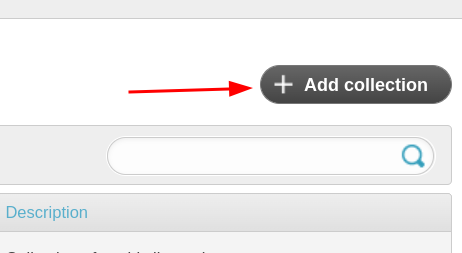
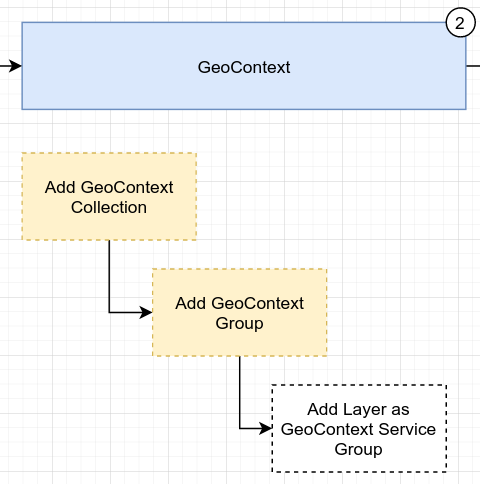
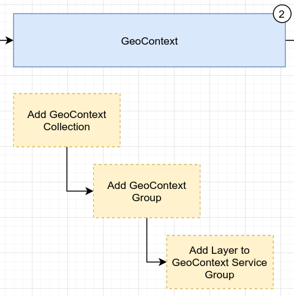
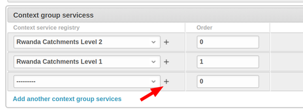

# Working with GeoContext Data

In this article we explain the concept of the GeoContext platform and how layers are published to it in BIMS.

## Creating a GeoContext Collection

A GeoContext collection is a set up web map services that can be queried in order to discover habitat or other relevant spatial data for a site.

From GeoContext collection [admin page](https://staging.geocontext.kartoza.com/admin/geocontext/collection/) click **Add collection button** to create a new collection

Fill out the required fields :

* Key - Key of the collection
* Name - Name of the collection

Click **Save** when you're done

## Adding a GeoContext Group

A GeoContext group is a subset of layers from a GeoContext collection that form a logical group, usually based around a theme such as temperature, political regions etc.

### Adding groups to existing collection

* From the [GeoContext Collection](https://staging.geocontext.kartoza.com/admin/geocontext/collection/) admin page, open the collection that you want to add groups to.
* From the Context groups section click **Add another collection group** link
* Find existing group that you want to add to the group.
* If you want to create a new group, click + sign next to the dropdown. See **Adding new Group** to learn how to create a new group from scratch.

You can arrange the group order as follows:

* Update the order text manually
* Or move the group by dragging the move item icon that is located on the far right before the x sign

In order to remove group from the group just click the **x** sign

### Adding a new Group

You can create a new group from the context group page or directly from layer admin page.

In order to create new group you need to fill out the required fields:

* **Key** - Key of the context group, this will be used in the bims to fetch the GeoContext data via API
* **Name** - Name of the group
* **Group Type** - Type of the group to determine the UI, choose Graph if this group depicting data over a time period. (e.g. monthly average temperature )

See other existing groups for guidance.

## Adding a layer to a GeoContext group

In this sectio we describe how you add a layer to a GeoContext group. A layer is a Web Mapping Service intended to make spatial information available over the internet, covering a specific thematic topic e.g. average annual temperature in March

### Adding Layers to an Existing GeoContext Group

* From the [GeoContext group](https://staging.geocontext.kartoza.com/admin/geocontext/group/) admin page, open the group that you want to add layers to.
* From the Context group services section click **Add another context group service** link
* Find existing layer that you want to add to the group.
* If you want to create a new layer, click + sign next to the dropdown. See **Adding new Layer** to learn how to create a new layer from scratch.

You can arrange the layer order as follows:

* Update the order text manually
* Or move the layer by dragging the move item icon that is located on the far right before the x sign

In order to remove layer from the group just click the x sign

Click **Save** when you're done updating the group.

### Adding a new Layer

You can create a new layer from the context group page or directly from layer admin page.

In order to create new layer you need to fill out the required fields:

* **Key**
* **Name**
* **Url** - Url of the layer service, e.g. if you use Geoserver then you can try following link : ``{geoserver_host}/geoserver/wfs``
* **Query Type** - Query type of the layer, usually we use WFS
* **Layer name** - Required name of the actual layer/feature to retrieve (Property name).
* **Layer typename** - Layer type name to get the context.
* **Service version** - Version of the service (e.g. WMS 1.1.0, WFS 2.0.0).

See other existing layers for guidance.
