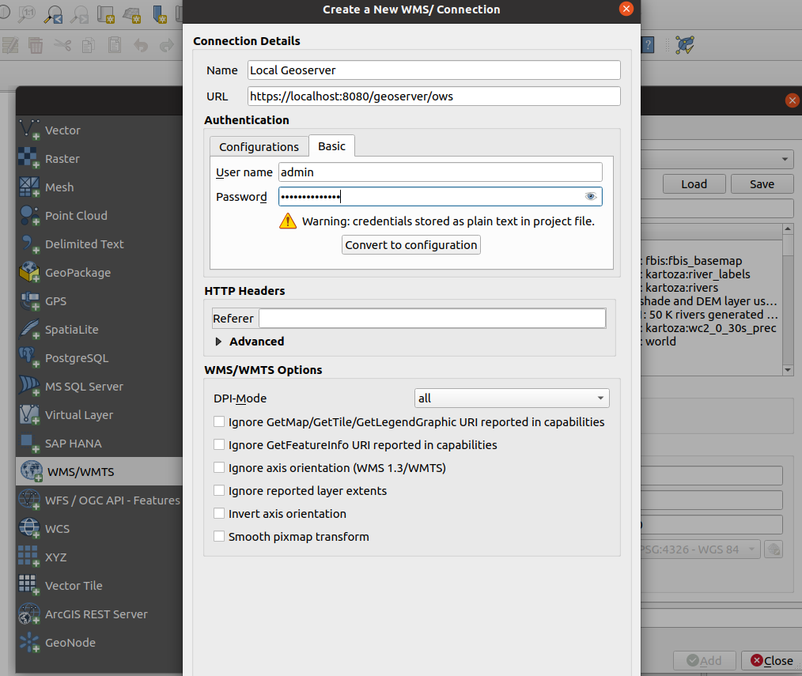
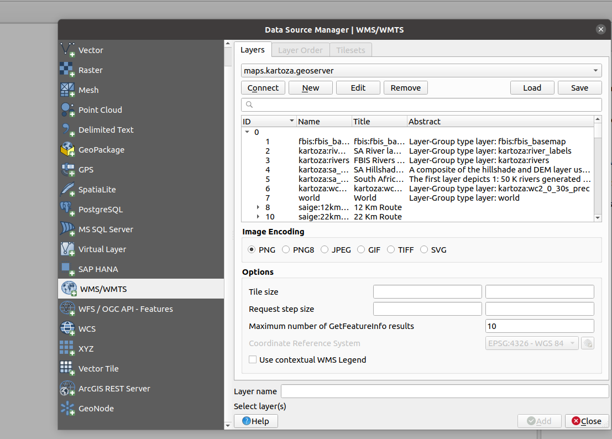

# Visualising layers in QGIS

QGIS provides native ways to interact with services coming from GeoServer.
Both services are OGC compliant and can communicate using the following protocols:

* WFS ( Web Feature Service) - renders vector features.
* WMS (Web Map Service) - renders as raster data.
* WCS (Web Coverage Service) - render the raw raster data.
* WMTS (Web Map Tile Service)
* OGC API

For each protocol, QGIS provides a native way to interact and authenticate against.

## Loading OGC Protocols in QGIS

**Step 1.** Activate the Data Source Manager.

**Step 2.** Select the protocol you need to define and add a new connection.

**Step 3.** Populate the dialogs. All the dialogs will have the same format.
WMS Dialog:

**Step 4.** Click connect to preview the resources available on the server.

**Step 5.** Select a layer to load into Geoserver and start interacting with it.

Repeat the above procedure for each service types.
