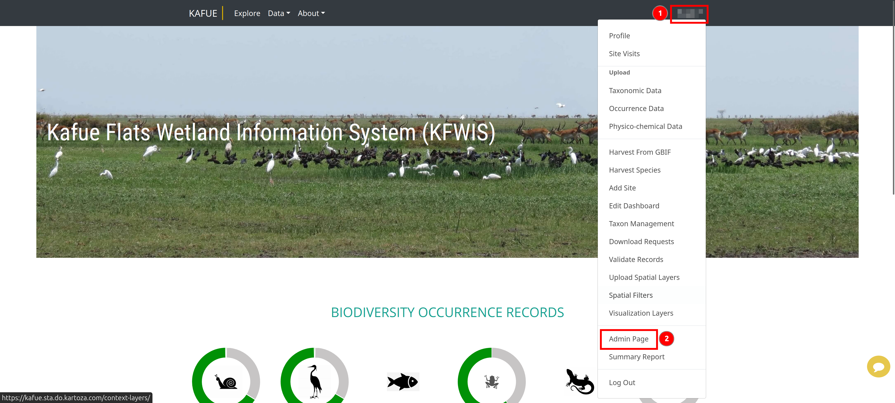
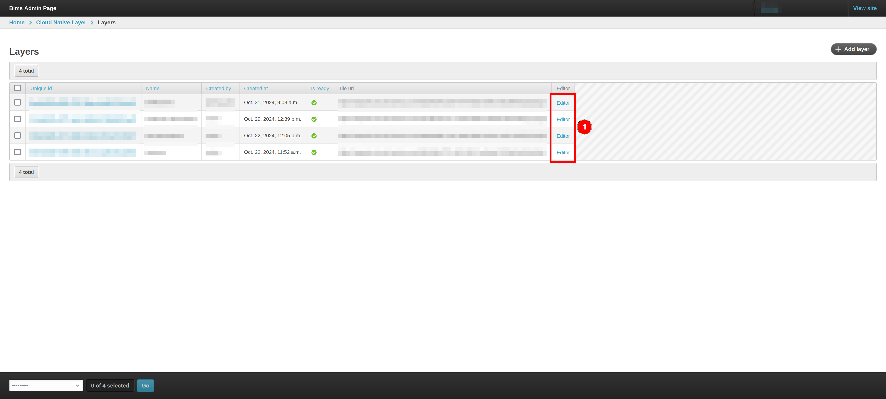
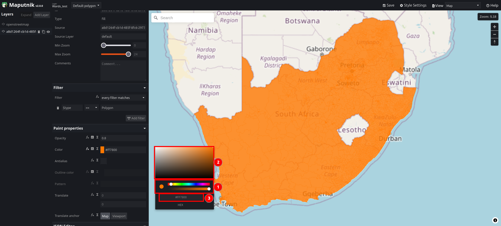
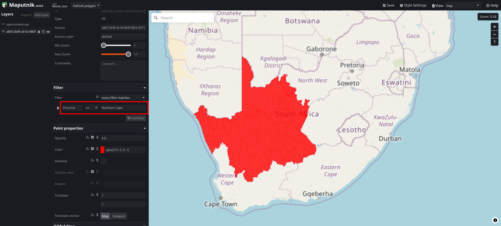

# BIMS: Styling Uploaded Layers

>Note: Only admin/super users can style spatial layers:

There are two methods to access the styling `Editor` page.

* [Access Method 1](#access-method-1-from-the-layer-upload-page): From the `Layer Upload` Page.
* [Access Method 2](#access-method-2-from-the-administration-site): From the `Administration` Page.

## Access Method 1: From the Layer Upload Page

To reach the `Layer Upload` page read through the [BIMS: Upload Spatial Layers](./upload-spatial-layers.md) guide. When you get to the [Access the Editor](./upload-spatial-layers.md#access-the-editor) section, you can click the link to return here.

## Access Method 2: From the Administration Page

As an admin/super user, access the `Administration` page by clicking on 1️⃣ your user name in the top right corner of any page and then click on 2️⃣ `Admin Page` on the dropdown menu.
> Note: If your BIMS instance has been customised, you may be able to hover your mouse pointer over `Administration` drop down menu from the top navigation bar.

On the `Administration` page, scroll down to 1️⃣ the `Cloud Native Layers` section and then click on 2️⃣ `Layers`.

On the `Layers` page, click on 1️⃣ the `Editor` link next to your preferred layer to be redirected to the `Editor` page.

## The Maputnik Style Editor Page

When you first arrive on the Maputnik Style editor page, you are greeted by a world map with a default style for the layer.

If the layer has been previously styled, you can click on 1️⃣ the `Style` dropdown to select the style you would like to edit.

### Styling a Spatial Layer

#### Basic Colour Change

To start styling a layer, zoom in on the area of the map where your layer should (e.g. This layer was for South Africa, so the map was zoomed in on South Africa).

If you would like to just change the colour of the layer, click on 1️⃣ the default style layer and then click on 2️⃣ the `Color` textbox that has a colour hexcode in it.

This will open a modal where you can either use 1️⃣ the various sliders and 2️⃣ colour box to select a colour, or you can paste in the hexcode of the colour you would like in 3️⃣ the textbox (ensure there is a # before the six characters).

This will change the colour of the entire layer.

#### Colour Based on Attribute

If you would like to style the layer based on an attribute you need to add a filter to your style layer and will need to add a new layer per different colour.

If you know the attribute name and attribute value you would like to use as a filter, you can can adapt the initial layer's filter to suit your needs. In this example, the attribute name is `Province` and the attribute value is `Northern Cape`.

If you are unsure of your filter requirements, you can click on 1️⃣ the `View` dropdown menu and then select 2️⃣ the `Inspect` option.

This will swap you to the inspection view, where you can use your mouse to click on features and display 1️⃣ a `Popup` with information about the feature(s) under your mouse.

If features are not displaying in the `Inspection` view, click on 1️⃣ the `Delete` filter icon.

