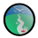

# Biodiversity Information Management System

Welcome to the Biodiversity Information Management System (BIMS) home page!

BIMS is a platform for managing and visualising biodiversity data.

All of the source code for the platform is open source, and it uses popular open source tooling such as Postgres/PostGIS, GeoServer, Django, Python as building blocks for the platform.

## Introduction

Freshwater Biodiversity Information System (FBIS) is an open-access, online platform for serving, hosting, analysing, visualising and sharing freshwater biodiversity data in South Africa. The overall purpose of the platform is to support data-driven freshwater decision-making and management in South Africa.

The system currently accepts and serves data on species occurrence, abundance and associated habitat and abiotic parameters, for anurans, fish, invertebrates, algae, odonate adults and wetland plants. It also accepts and serves water temperature time series data and physico-chemical data.

System design and functionality was strongly informed by data and reporting needs of key end-user groups, including water resource managers, biodiversity and conservation managers and planners, scientific researchers, and environmental consultants. Future expansion of FBIS aims to increase the diversity of data accessed, data flow, geographic coverage and strategically embed FBIS into South Africa’s main freshwater decision-making pipelines.

Platform development was funded by the JRS Biodiversity Foundation through two grants: 2017-2020 (Phase 1) and 2021-2024 (Phase 2). The platform was developed by the Freshwater Research Centre in partnership with Kartoza and the South African National Biodiversity Institute.

A scientific article has been published in the African Journal of Aquatic Science and is available [here](https://www.tandfonline.com/doi/abs/10.2989/16085914.2021.1982672?needAccess=true&journalCode=taas20). The citation for the article is:

Dallas HF, Shelton JM, Sutton T, Tri Ciputra D, Kajee M and Job N.  2021. Development of a freshwater biodiversity information system for evaluating long-term change in rivers in South Africa.  African Journal of Aquatic Science. doi.org/10.2989/16085914.2021.1982672

The link to the FBIS site: [https://freshwaterbiodiversity.org/](https://freshwaterbiodiversity.org/)
