# Key dashboard components

Below we provide a brief description of the different dashboard components. **Note** that whenever a component includes a {: style="height:16px"} symbol in the component header, clicking that icon will download a graphic file ‘snapshot’ of that component. This approach allows you to quickly grab any elements you need from the dashboard and include them in your reports. We took this approach over producing a full PDF report so that you have the flexibility of choosing which specific elements of the dashboard to use in your papers and reports.

More detailed data downloads are available via the {: style="width:250px"} button.

## Filter history

The filter history component is intended to make it clear how the data displayed in the dashboard have been filtered and what specific search criteria have been applied.

**The filter history component details what search and filter query were active when generating the current dashboard report.**

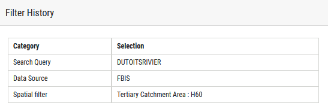

This component is present in these dashboards:

* Taxon dashboard
* Single-site biodiversity dashboards
* Multi-site biodiversity dashboards
* Multi-site SASS dashboard

## Map

The map provides a cartographic representation of the selected site or sites used when generating the dashboard report. The map includes a scale bar and a graticule with graticule labels so that the viewer may orientate themselves as to the location of the data depicted on the map. Note that the background map is © OpenStreetMap and contributors and is used with permission. This attribution (© OpenStreetMap and contributors) should be included anywhere the downloaded map image is published.

**The distribution component of the dashboards shows selected sites on a map.**

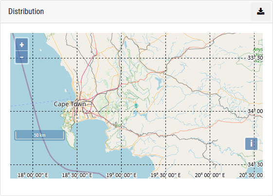

This component is present in these dashboards:

* Taxon dashboard
* Single-site biodiversity dashboards
* Multi-site biodiversity dashboards
* Single-site SASS dashboard
* Multi-site SASS dashboard
* Water temperature dashboard
* Physico-chemical dashboard

## Site photograph(s)

Photographs of the site are provided when available. These can be scrolled through if more than one is available. Future versions of FBIS will include a date stamp.

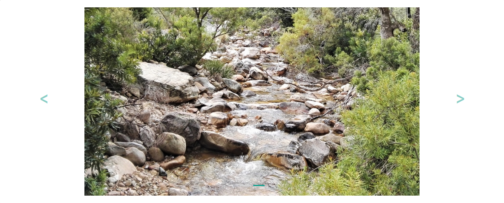

This component is present in these dashboards:

* Taxon dashboard
* Single-site biodiversity dashboards
* Single-site SASS dashboard
* Water temperature dashboard
* Physico-chemical dashboard

## Overview

**The overview component of the dashboard provides a detailed situational analysis for a site.**

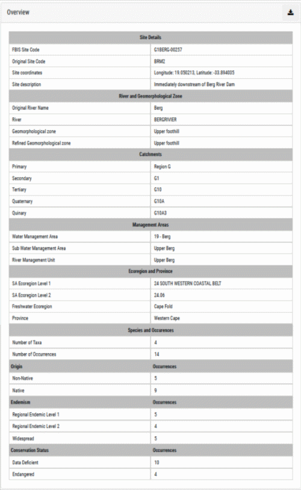

The overview component provides context information (from GeoContext) and biodiversity status tabular breakdown of the site (or sites) being reported on (based on the currently applied filters and search query). The overview is broken down into different sections:

* Site details
* River and geomorphological zone
* Catchments
* Water Management Areas
* Ecoregion and province
* Species and occurrences. For single-site dashboards, the site count is not shown.
* Origin (number of native versus non-native species)
* Endemism
* Conservation status

For multi-site dashboards, a reduced version of the overview panel is shown. This is because many of the items listed above are not relevant in the context of a multi-site dashboard.

**Simplified version of the overview panel used for multi-site dashboards.**

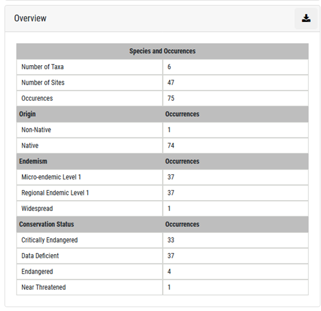

This component is present in these dashboards:

* Taxon dashboard
* Single-site biodiversity dashboards
* Multi-site biodiversity dashboards
* Single-site SASS dashboard
* Water temperature dashboard (excluding biodiversity aspects)
* Physico-chemical dashboard (excluding biodiversity aspects)

## Occurrence charts

The occurrence pie charts summarise the following details for the taxa recorded at the site or sites (Figure 19):

* Origin
* Endemism
* Conservation status
* Sampling method
* Biotope

Note there is a paucity of sampling method data lodged in the database. The FBIS encourages users to capture the sampling method (and effort) so we have included it as a data capture and reporting element, even though the sampling method will often be unpopulated.

**Occurrence chart dashboard component.**

All of the pie charts have tooltips enabled - hovering the mouse over a particular pie segment will show the details for that segment.

This component is present in these dashboards:

* Taxon dashboard
* Single-site biodiversity dashboards
* Multi-site biodiversity dashboards

## Occurrences

The occurrences chart provides a breakdown of the number of observation records (across all taxa) recorded over time (aggregated by year).

**Occurrences chart showing recorded observations over time.**

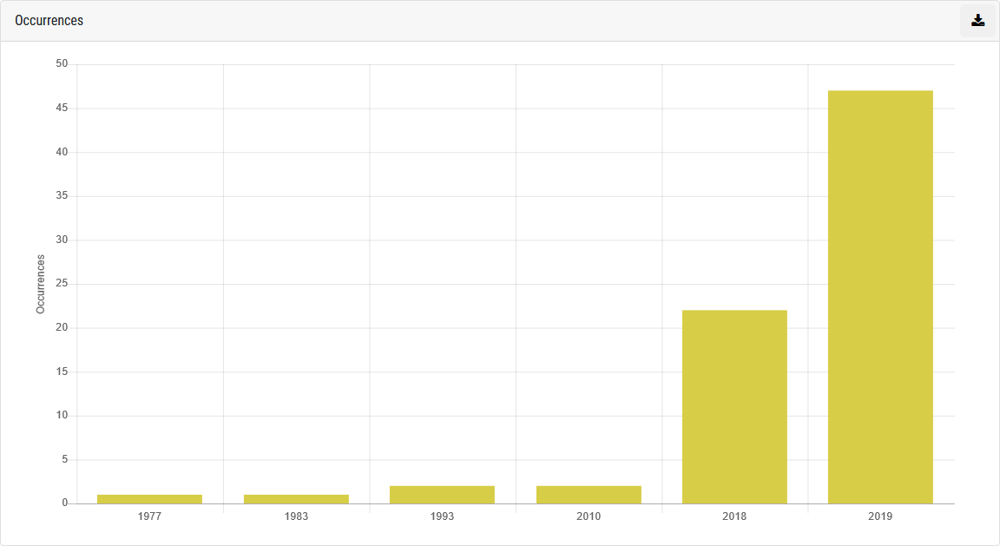

This component is present in these dashboards:

* Taxon dashboard
* Single-site biodiversity dashboards
* Multi-site biodiversity dashboards

## Taxa

The taxa chart breaks down the occurrences per year by taxa as a stacked bar chart. The chart is interactive: clicking on a legend item will remove that taxon from the chart.

**Occurrences chart showing recorded taxa over time.**

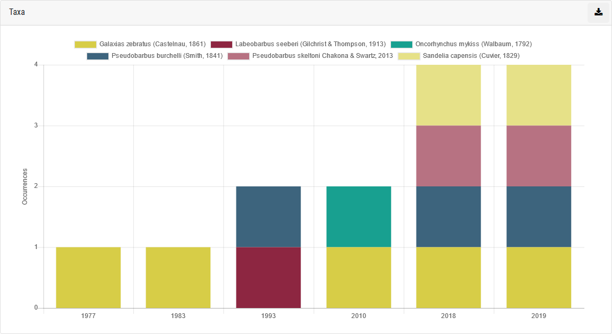

This component is present in these dashboards:

* Single-site biodiversity dashboards
* Multi-site biodiversity dashboards

## Origin

The origin chart breaks down the occurrence data by origin (native vs. non-native vs. translocated status) per year. The chart is interactive: clicking on a legend item will remove that origin status from the chart.

This component is present in these dashboards:

* Single-site biodiversity dashboards
* Multi-site biodiversity dashboards

Origin has only been captured for fish and for some invertebrates, and will be updated as information becomes available.

Origin categories:

* Native: (or indigenous) means a taxon occurring within its natural range (past or present) and dispersal potential (i.e. within the range it occupies naturally or could occupy without direct or indirect introduction or care by humans).
* Non-Native: a category that includes both alien and extralimital taxa.

**Origin chart.**

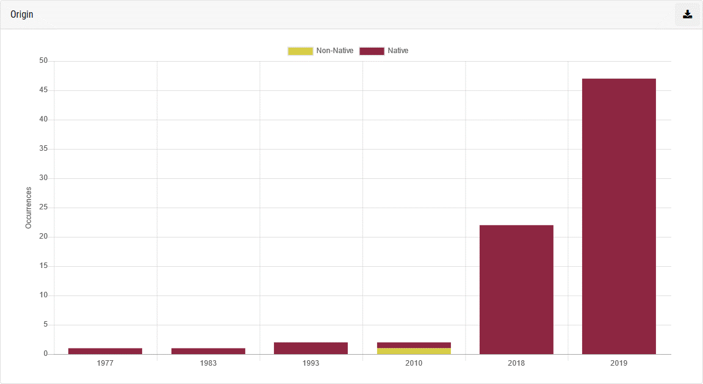

## Endemism

This component provides a breakdown of the occurrence data based on the endemism status of the taxa recorded.

**Figure 23: Endemism chart.**

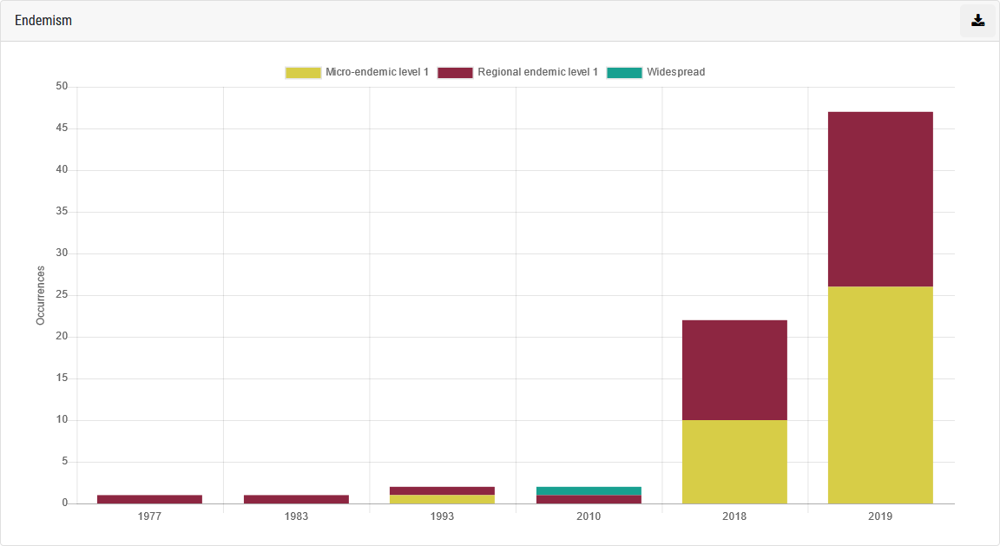

Endemism categories:

* Micro-endemic level 2 (Endemic to a single river or wetland)
* Micro-endemic level 1 (Endemic to less than 5 rivers or wetlands)
* Regional endemic level 2 (Endemic to a single primary catchment)
* Regional endemic level 1 (Endemic to a single Freshwater Ecoregion (e.g. CFE), more than one primary catchment)
* National endemic (Endemic to South Africa, occurs in more than one Freshwater Ecoregion within SA)
* Subregional endemic (Endemic to southern Africa)
* Widespread (Occurs beyond southern Africa)
* Unknown (Endemism is unknown)

Endemism has only been captured for fish and some invertebrates, and will be updated as information becomes available.

This component is present in these dashboards:

* Single-site biodiversity dashboards
* Multi-site biodiversity dashboards

## Conservation status

**Conservation status chart.**

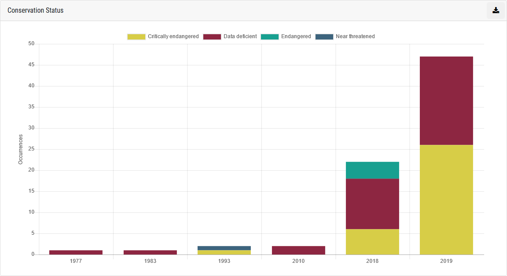

This component provides a breakdown of occurrences, aggregated by year, according to the conservation status (based on IUCN categories) of the taxa recorded. The IUCN Red List of Threatened Species website (IUCN Red List, 2020) classifies species into six main categories based on their extinction risk. Clicking on the legend entry will hide or show that category from the chart.

Conservation status has only been captured for fish as conservation status has not yet been evaluated for invertebrates or algae. It will be updated as information becomes available.

Conservation status categories:

* Not evaluated
* Data deficient
* Least concern
* Near threatened
* Vulnerable
* Endangered
* Critically endangered

This component is present in these dashboards:

* Single-site biodiversity dashboards
* Multi-site biodiversity dashboards

----

**A general note for all charts**
When downloading a chart using the   icon, the resulting downloaded file will be saved to your device as an ‘SVG’ (Scalable Vector Graphic) file or in some cases a .png file. This file can be arbitrarily resized and maintain its quality, allowing it to be used in print publications or large format printing projects.
<!-- comment for formatting -->
To use the SVG, use the **Insert** -> **Pictures** -> **From File** option in Word or Excel. Once added it to your document, you can resize the frame and the quality will be preserved.

----

## Occurrence data

**Tabular summary of occurrence data.**

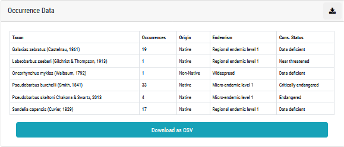

This module provides a tabular summary of occurrence data. The data are aggregated per taxon (giving a total count of recorded occurrences for that taxon). Additional columns indicate the origin, endemism and conservation status for each taxon.

The download link will provide a Comma Separated Values (CSV) file which can easily be opened in a spreadsheet application like Microsoft Excel, or a GIS application like QGIS. The CSV document also includes the individual records (not aggregated as in the summary table) with all associated spatial and abiotic data for each occurrence record.

**CSV Download example.**

This component is present in these dashboards:

* Taxon dashboard
* Single-site biodiversity dashboards
* Multi-site biodiversity dashboards

## Abiotic data graphs

Physico-chemical data are provided as graphs for four variables. All other abiotic data collected at the same time as the survey may be downloaded In the CSV document.

**Abiotic data charts.**

This component is present in these dashboards:

* Single-site biodiversity dashboards
* Single-site SASS dashboard

## Metadata Table

All metadata associated with occurrence records are provided in a metadata table. Sources of biodiversity data have been categorised into one of the following five categories: peer-reviewed scientific articles, theses, published reports, databases and unpublished data. Links to the citation are provided via DOI, URL or as a PDF for published reports, if available.

**Metadata table example.**

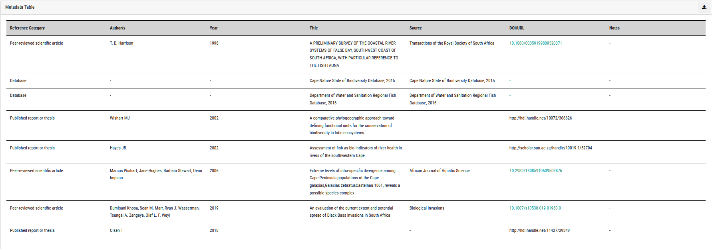

This component is present in these dashboards:

* Single-site biodiversity dashboards
* Multi-site biodiversity dashboards
* Single-site SASS dashboard
* Multi-site SASS dashboard
* Water temperature dashboard
