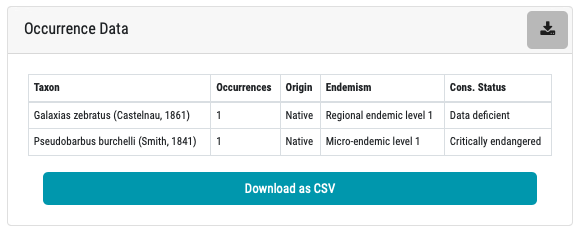
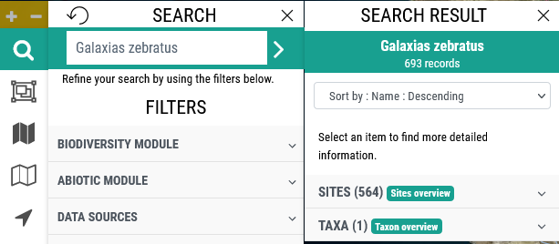
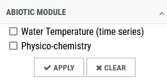

# Key concepts

**Site**: A specific location along a river course where sampling or assessments take place.

**FBIS Site-code**: A unique name given to each site made up of:

* Two characters representing the secondary catchment code e.g. G1
* Four characters representing the river name e.g. JONK. This is currently derived from the 1:500 000 DWS rivers layer. If the river does not have a name on this layer, then the nearest river name is taken. For this reason it is important for a user to add the Original river name on the Site form if the river is unnamed (e.g. a small tributary).
* A hyphen i.e. –
* Five characters representing the nearest place name e.g. SIMONS. In many cases these five characters are replaced by a numeric value where a place name has not been identified. The Original Site Code and Original River Name from the original study are also provided.
* The site code is generated automatically unless the user as a standard name.

>**place holder for update to wetland site code**

**River**: This is currently derived from the 1:500 000 DWS rivers layer. If the river does not have a name on this layer, then the nearest river name is taken. For this reason it is important for a user to add the Original river name on the Site form if the river is unnamed (e.g. a small tributary). (See section 11.1 Create a site).

**Occurrence record**: One collection record for a taxon at a given site. This record may optionally include abundance data.

**Search**: The process whereby free-form text is entered into the search box and the matching records are shown on the map.

**Filters**: Often used in conjunction with search, filtering allows you to narrow down the result set based on predefined spatial, temporal and biological criteria, such as province, date, species, etc.

**Biodiversity Module**: A higher taxonomic grouping of taxa (and thus their related collection records). Modules can have their own dashboard implementations and data capture forms to capture information specific to the kind of taxa in the module grouping.

**Abiotic Module**: A module serving abiotic data including water temperature time series data and physico-chemical data.

