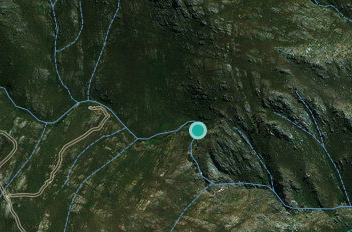
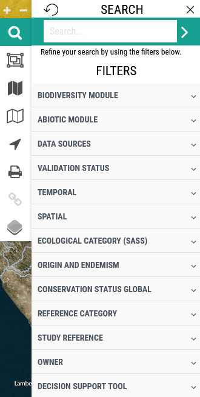
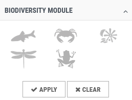

# Quickstart

## Introduction

Freshwater Biodiversity Information System (FBIS) is an open-access, online platform for serving, hosting, analysing, visualising and sharing freshwater biodiversity data in South Africa. The overall purpose of the platform is to support data-driven freshwater decision-making and management in South Africa.

The system currently accepts and serves data on species occurrence, abundance and associated habitat and abiotic parameters, for anurans, fish, invertebrates, algae, odonate adults and wetland plants. It also accepts and serves water temperature time series data and physico-chemical data.

System design and functionality was strongly informed by data and reporting needs of key end-user groups, including water resource managers, biodiversity and conservation managers and planners, scientific researchers, and environmental consultants. Future expansion of FBIS aims to increase the diversity of data accessed, data flow, geographic coverage and strategically embed FBIS into South Africa’s main freshwater decision-making pipelines.

Platform development was funded by the JRS Biodiversity Foundation through two grants: 2017-2020 (Phase 1) and 2021-2024 (Phase 2). The platform was developed by the Freshwater Research Centre in partnership with Kartoza and the South African National Biodiversity Institute.

A scientific article has been published in the African Journal of Aquatic Science and is available [here](https://www.tandfonline.com/doi/abs/10.2989/16085914.2021.1982672?needAccess=true&journalCode=taas20). The citation for the article is:

Dallas HF, Shelton JM, Sutton T, Tri Ciputra D, Kajee M and Job N.  2021. Development of a freshwater biodiversity information system for evaluating long-term change in rivers in South Africa.  African Journal of Aquatic Science. doi.org/10.2989/16085914.2021.1982672

The link to the FBIS site: [https://freshwaterbiodiversity.org/](https://freshwaterbiodiversity.org/)

This manual aims to provide details on key aspects of FBIS and expand on its functionality. It is accompanied by a series of video clips that demonstrate various workflows that users are likely to need (a short video tutorial series is available ([here](https://www.youtube.com/playlist?list=PLSbcS_PS6gw07F6a8HnDJPt3BHcnqIP2O))).

## Key concepts

**Site**: A specific location along a river course where sampling or assessments take place.

**FBIS Site-code**: A unique name given to each site made up of:

* Two characters representing the secondary catchment code e.g. G1
* Four characters representing the river name e.g. JONK. This is currently derived from the 1:500 000 DWS rivers layer. If the river does not have a name on this layer, then the nearest river name is taken. For this reason it is important for a user to add the Original river name on the Site form if the river is unnamed (e.g. a small tributary).
* A hyphen i.e. –
* Five characters representing the nearest place name e.g. SIMONS. In many cases these five characters are replaced by a numeric value where a place name has not been identified. The Original Site Code and Original River Name from the original study are also provided.
* The site code is generated automatically unless the user as a standard name.

**River**: This is currently derived from the 1:500 000 DWS rivers layer. If the river does not have a name on this layer, then the nearest river name is taken. For this reason it is important for a user to add the Original river name on the Site form if the river is unnamed (e.g. a small tributary). (See section 11.1 Create a site).

**Occurrence record**: One collection record for a taxon at a given site. This record may optionally include abundance data.

**Search**: The process whereby free-form text is entered into the search box and the matching records are shown on the map.

**Filters**: Often used in conjunction with search, filtering allows you to narrow down the result set based on predefined spatial, temporal and biological criteria, such as province, date, species, etc.

**Biodiversity Module**: A higher taxonomic grouping of taxa (and thus their related collection records). Modules can have their own dashboard implementations and data capture forms to capture information specific to the kind of taxa in the module grouping.

**Abiotic Module**: A module serving abiotic data including water temperature time series data and physico-chemical data.

## Signing up and logging in

Visit [freshwaterbiodiversity.org](https://freshwaterbiodiversity.org/) to login, sign up and explore. Complete the **Sign Up** to register to use FBIS, including details of your organisation and role in the freshwater community.

